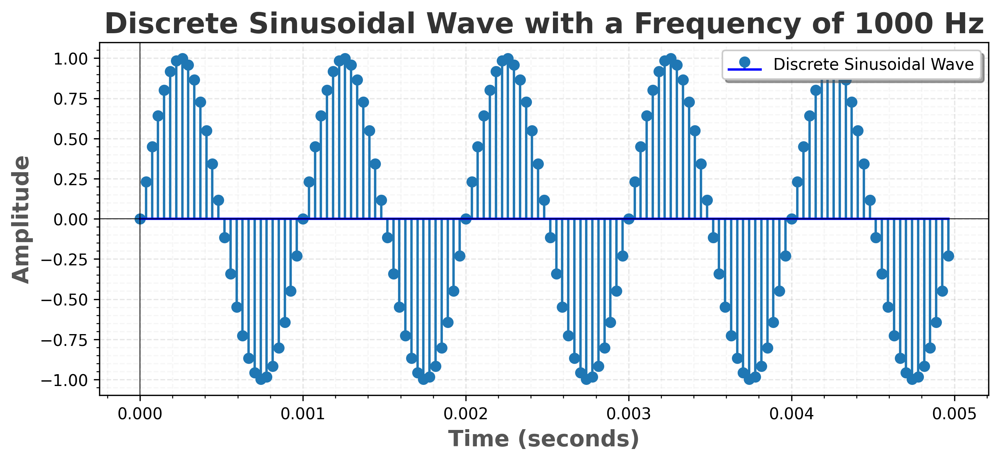

# Discrete Sinusoidal Wave Plot 🌊

Immerse yourself in the enchanting realm of discrete sinusoidal waves using this Python script. It generates and plots a mesmerizing waveform of your chosen frequency.

## Prerequisites

Make sure you have Python and Matplotlib installed on your machine.

## Usage

1. **Clone the repository:**
   ```bash
   git clone https://github.com/ansarialireza/sinusoidal-wave-plot.git
   ```

2. **Navigate to the project directory:**
   ```bash
   cd sinusoidal-wave-plot
   ```

3. **Run the Python script:**
   ```bash
   python sinusoidal_wave_plot.py
   ```
   Witness the magic as the script generates and displays the captivating discrete sinusoidal wave plot.

4. **Optional - Admire the Art:**
   Explore the saved plot as a PNG file in the same directory. Behold the beauty:

   

   For a closer look, gaze upon the plot directly on GitHub by clicking the 📈 [Plot Image](discrete_sinusoidal_wave_plot.png) link.

## Customization

Feel empowered to customize the frequency of the discrete sinusoidal wave by simply modifying the `f` variable in the script.

## Additional Plotting Elegance

For those in search of unparalleled elegance, use a custom plotting class:

   ```python
   plotter = DiscreteSinusoidalWavePlotter(sampling_rate=27000, frequency=1000, duration=5)
   plotter.plot_wave()
   plotter.save_plot()
   plotter.show_plot()
   ```

## Dependencies

- Python
- Matplotlib

## Author

Alireza Ansari 🎨

## License

This project is licensed under the MIT License - see the 📜 [LICENSE](LICENSE) file for details.