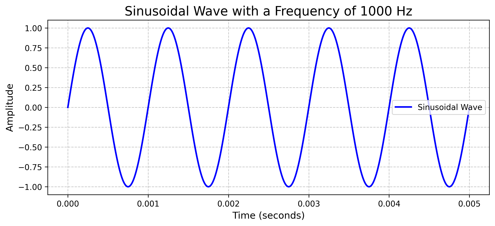

# Sinusoidal Wave Plot

This Python script generates and plots a sinusoidal wave with a specified frequency.

## Prerequisites

Make sure you have Python and Matplotlib installed on your machine.

## Usage

1. Clone the repository:
   ```bash
   git clone https://github.com/ansarialireza/sinusoidal-wave-plot.git
   ```

2. Navigate to the project directory:
   ```bash
   cd sinusoidal-wave-plot
   ```

3. Run the Python script:
   ```bash
   python sinusoidal_wave_plot.py
   ```
   This will generate and display the sinusoidal wave plot.

4. Optionally, you can find the plot saved as a PNG file in the same directory. Here is the generated plot:
   
   You can also view the plot directly in GitHub by clicking on the [Plot Image](sinusoidal_wave_plot.png) link.

## Customization

You can customize the frequency of the sinusoidal wave by modifying the `f` variable in the script.

## Dependencies

- Python
- Matplotlib

## Author

Reza Ansari

## License

This project is licensed under the MIT License - see the [LICENSE](LICENSE) file for details.